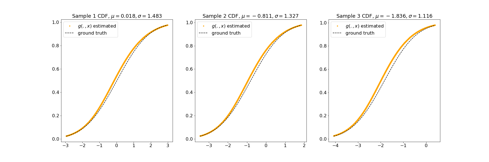

# Collaborating-Network-Example

This repository contains the code associated with one synthetic example of paper by Zhou, Li, Yuan and Carlson. The manuscript is now available on Arxiv (https://arxiv.org/abs/2002.05212). This example illustrates how to use collaborating networks(CN) to estimate the conditional distribution $Y|X$ of continuous outcome.

## Data Generation
In this case, we simulate a two dimensional covariate space x=[mu,sigma] each individual is distributed as Y|x~ N(mu,sigma^2). The data generation procedure is described in data_generation, and can be reproduced by
    
    $python Heteroscedastic_Gsussian_Generation.py
    

## Training and Evaluation
The implementation was based on Python 3 and Tensorflow 2.0 in folder Het_Gaussian_CN. The complete example of using g(.,x) and f(.,x) to approach conditional cdf and its inverse is included in Collaborating-Network-Example/Het_Gaussian_CN.ipynb. After training, the conditional quantile and distribution for each individual is estimated with g(.,x), which was shown to have better statistical properties in paper.

We evaluated the trained CN on calibration: a quantity indicating the discrepancy between nominal level and empirical level of coverage. CN has a close match to ground truth.

Or we could sketch CDF for a few random samples by their mean and standard deviation, and compare the CN estimated to the ground truth. Again, CN has a good recover of conditional CDF.

